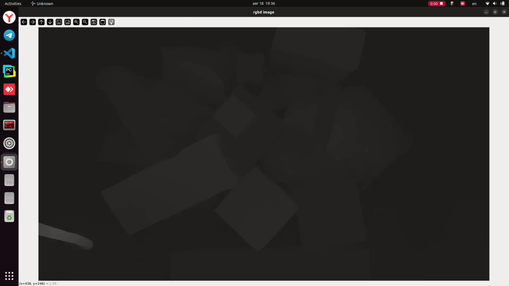

# CREStereo_RealSense
 This is non-official PyTorch implementation of CREStereo for realtime inference on RealSense cameras (model converted from the original MegEngine implementation).

  

# Dependencies
**I used the following dependencies (maybe it will work in older versions):**
- Python: 3.10.12
- CUDA: 12.8
- PyTorch: 2.7.1
- numpy: 1.26.4
- opencv-python: 4.12.0.88
- Open3D: 0.19.0

# Table of Contents
- `realtime_rgbd_image.py`: realtime depth estimation, ~3-5 fps (PyTorch inference)
- `realtime_rgbd_image_onnx_model.py`: it also works, but very slowly (ONNX inference)
- `point_cloud_visualization.py`: visualization of a point cloud using Open3D (PyTorch inference)

  

# Pretrained model
Download models from [here](https://drive.google.com/drive/folders/1KFznC-eKIy7lbL2rH1jrTNdySauGP8KQ?usp=sharing) and save it into the `models` folder.
- `crestereo_eth3d.pth` for PyTorch inference.
- `crestereo.onnx` and `crestereo_without_flow.onnx` for ONNX inference.

# Important
- This is just an effort to try to implement the CREStereo model into Pytorch from MegEngine due to the issues of the framework to convert to other formats.
- I am not the author of the paper, and I am don't fully understand what the model is doing. Therefore, there might be small differences with the original model that might impact the performance.
- I have not added any license, since the repository uses code from different repositories.

# References:
- CREStereo: https://github.com/megvii-research/CREStereo
- CREStereo-Pytorch: https://github.com/ibaiGorordo/CREStereo-Pytorch
- intel RealSense: https://github.com/IntelRealSense/librealsense
- Open3D: https://github.com/isl-org/Open3D